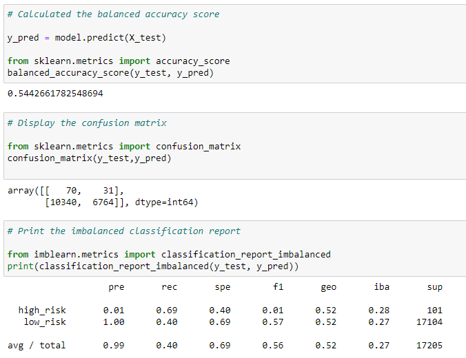
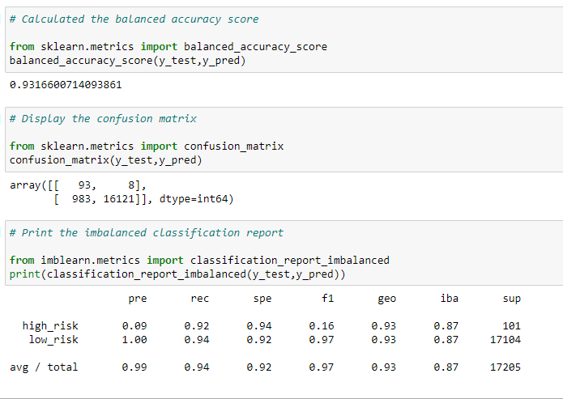

# Credit_Risk_Analysis
Credit Risk analysis using Supervised Machine Learning

## Overview of the Project

### Project Background:

FastLending, peer to peer lending service wants to use machine learning to predict credit risk. Management believes that this will provide a quicker and more reliable loan experience.  It also believes that machine learning will lead to a  more accurate identification of good candidates  for which will lead to lower default rates.  

### Purpose:

Evaluate three machine learning models by using resampling to determine which is better at predicting credit risk using imbalanced-learn and scikit-learn libraries and using credit card credit dataset from LendingClub, a peer-to-peer lending service.

- Oversample the data using the RandomOverSampler and SMOTE algorithms 
- Undersample the data using the ClusterCentroids algorithm
- Use a combinatorial approach of over- and undersampling using the SMOTEENN algorithm

- Compare two new machine learning models that reduce bias, BalancedRandomForestClassifier and EasyEnsembleClassifier, to predict credit risk. 

## Resources:

Data Sources: Credit card credit dataset (LoanStats_2019Q1.csv) from LendingClub, a peer-to-peer lending services company

Tools: Python Supervised Machine Learning algorithms, imbalanced-learn and scikit-learn libraries

## Analyis 

Oversampling
- Naive Random Oversampling

- SMOTE Oversampling

Undersampling
- ClusterCentroids resampler

- SMOTEENN (Combination (Over and Under) Sampling

- Easy Ensemble AdaBoost Classifier

## Summary

Evaluate algorithm'sperformance and see how well the model predict data. 

Random oversampling - Accuracy Score is 0.6573; precision is .01, F1 score is .02 for high-risk loans 
Smote oversampling - While the Accuracy Score improved slightly (0.66224) over the Random Sampling, precision and F1 score for high-risk loans didn't improve.
Undersampling - The results are worse with Accuracy Score of only 0.5442, precision remained same 0.01, F1 score decreased to .01
SMOTEENN (combination - over and under) - While the Accuracy Score (0.6876) improved slightly, precision and F1 score for high-risk loans didn't improve.

Balanced Random Forest Classifier - Accuracy score of 0.78855, precision .03, F1 score of .06
Easy Ensemble AdaBoost Classifier - Accuracy Score of .93166, precision of high-risk 0.09, recall of 0.92, F1 score of 0.16

SMOTEENN (Combination of Over and Under) Sampling technique performed the best as it gave the highest Accuracy Score of 0.6876, while the Precision (.01) and F1 Score (0.02) remained at par with other sampling techniques. 

Easy Ensembel AdaBoost Classifier performed the best with the Accuracy Score of 93%.  However the precision for high-risk loans remained low (0.09).

