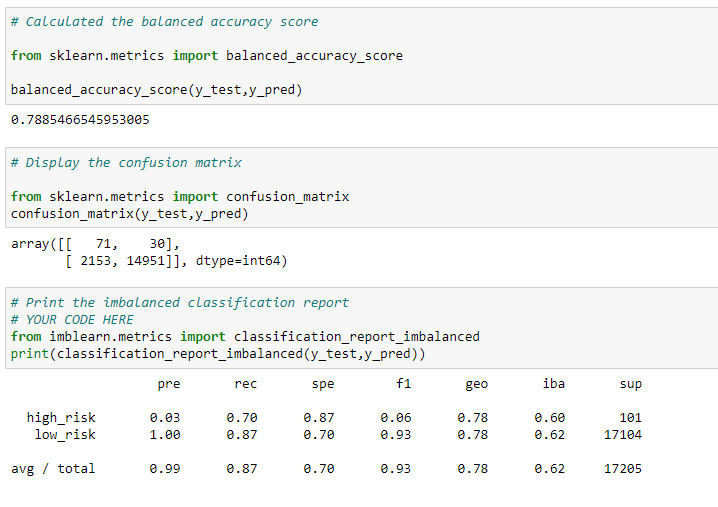
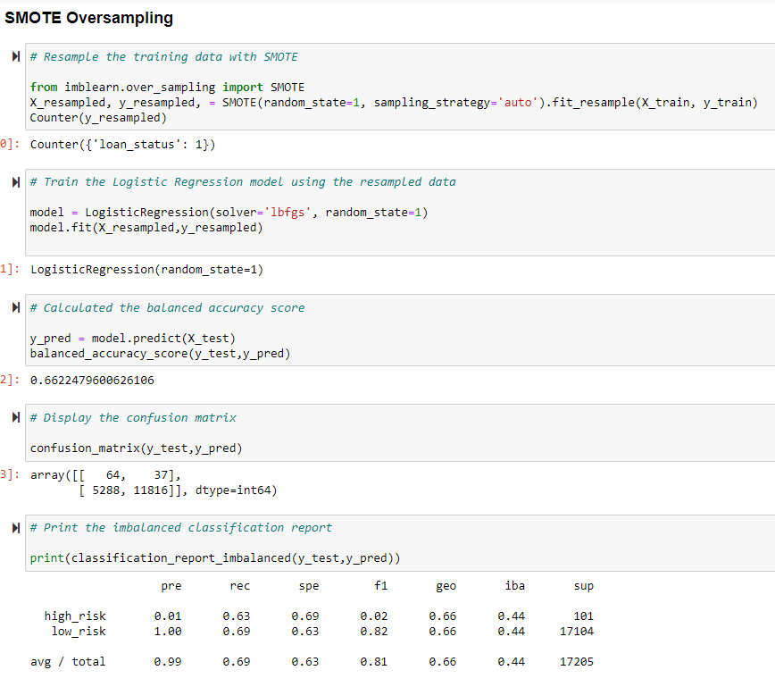

# Credit_Risk_Analysis
Credit Risk analysis using Supervised Machine Learning

## Overview of the Project

### Project Background:

FastLending, peer to peer lending service wants to use machine learning to predict credit risk. Management believes that this will provide a quicker and more reliable loan experience.  It also believes that machine learning will lead to a  more accurate identification of good candidates  for which will lead to lower default rates.  

### Purpose:

Evaluate three machine learning models by using resampling to determine which is better at predicting credit risk using imbalanced-learn and scikit-learn libraries and using credit card credit dataset from LendingClub, a peer-to-peer lending service.

- Oversample the data using the RandomOverSampler and SMOTE algorithms 
- Undersample the data using the ClusterCentroids algorithm
- Use a combinatorial approach of over- and undersampling using the SMOTEENN algorithm

- Compare two new machine learning models that reduce bias, BalancedRandomForestClassifier and EasyEnsembleClassifier, to predict credit risk. 

## Resources:

Data Sources: Credit card credit dataset (LoanStats_2019Q1.csv) from LendingClub, a peer-to-peer lending services company

Tools: Python Supervised Machine Learning algorithms, imbalanced-learn and scikit-learn libraries

## Analyis 

Oversampling
- Naive Random Oversampling

- SMOTE Oversampling

Undersampling
- ClusterCentroids resampler
- SMOTEENN (Combination (Over and Under) Sampling

Ensemble Learners
- Balanced Random Forest Classifier
- Easy Ensemble AdaBoost Classifier

## Summary

Evaluate algorithm'sperformance and see how well the model predict data. 

